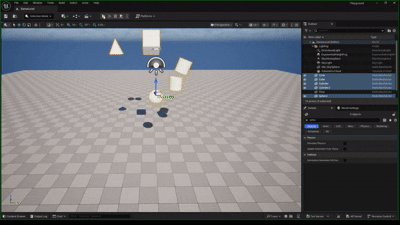
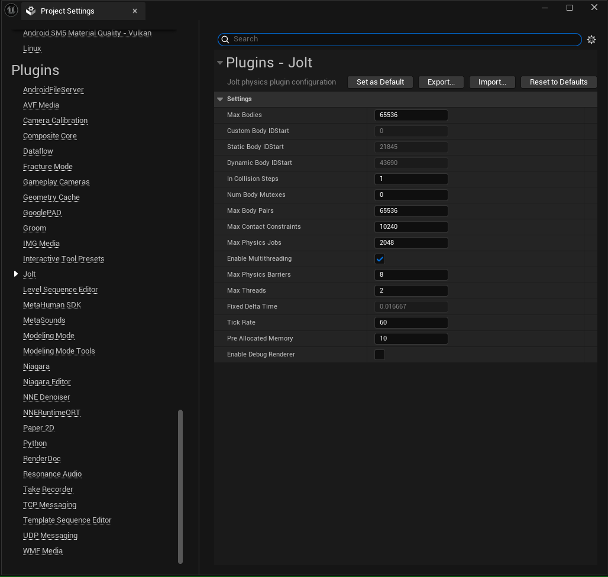
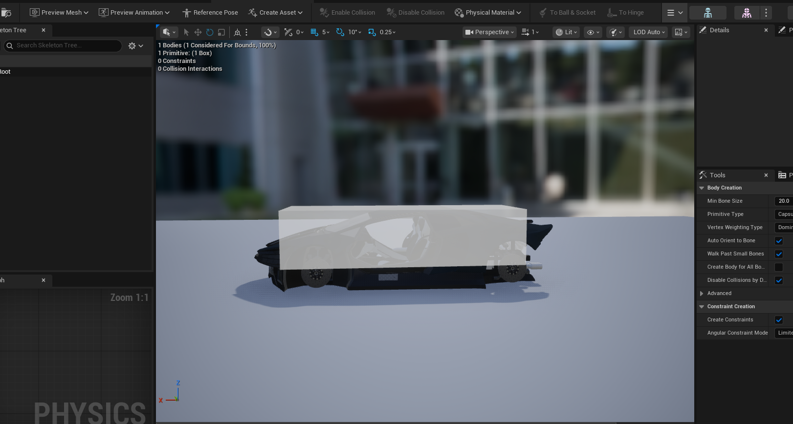
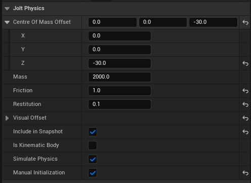
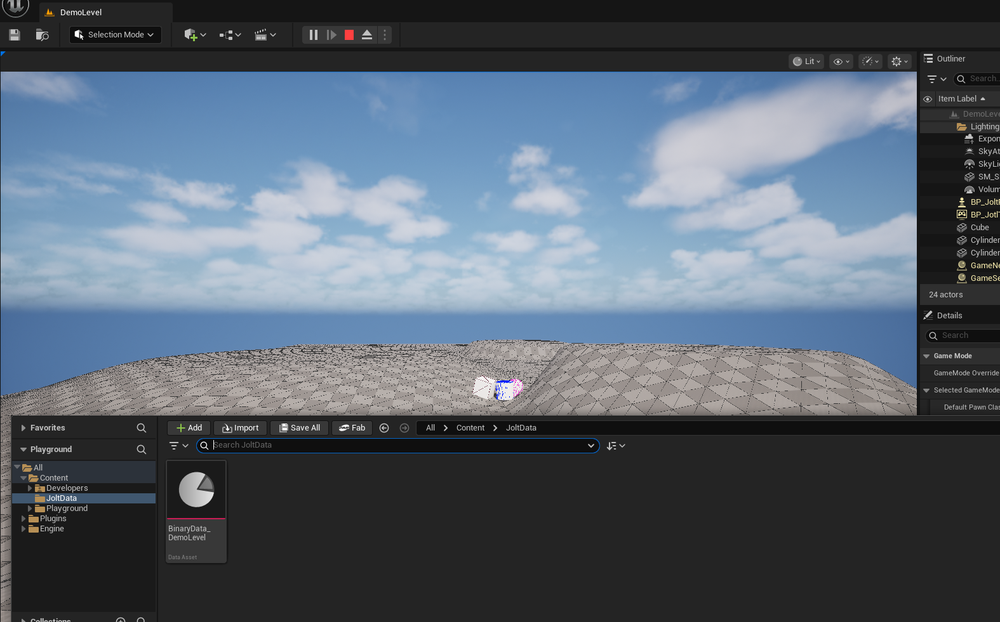

# UnrealJolt

Plugin that brings [Jolt Physics](https://github.com/jrouwe/JoltPhysics) into unreal engine 5

---

## Getting Started

### Some things to consider before using this

- This is a bolt on integration and not a replacement for the existing chaos physics solver.
- You should only need this if you specifically want some kind of behaviour that's not available in chaos.
- Deterministic physics, multicore processing of many bodies could make the case.
- Multicore processing it not yet implemented properly using Unreal's own thread pool system. 
- The implementation of this plugin while is generic (somewhat), is still tied to something I am developing on the side. Just keep in mind that all features of UE might not be integrated, you might have to do it yourself. (Drop a PR if you do :) )
- There are possibilities of breaking changes, until 1.0.0 at least. (will try to avoid)

### Requirements

- Unreal engine 5 (mostly tested on 5.6.0, should work on older versions)

### Installation

- Clone (`git clone --recursive git@github.com:Yadhu-S/UnrealJolt.git`) or download into the `Plugins` folder (`<project>/Plugins or Engine/Plugins`)
- Take a look inside `UnrealJoltLibrary.Build.cs` to see the user defines, modify what you need, or leave defaults. Check the available defines [ here ]( https://jrouwe.github.io/JoltPhysicsDocs/5.3.0/md__build__r_e_a_d_m_e.html )
- Compile project
- Make sure UnrealJolt is enabled in "Plugins"
- Use actor-tag and tag dynamic objects with `jolt-dynamic` (make sure that the object is movable) and static objects with `jolt-static` 

### Configuration

- Plugins->Jolt in your project settings.
- Check the defaults, and change if required.
- Debug rendering is slow, especially when visualizing large heightmaps. Drawing all those triangles. (Need to look into drawing triangles only once for
  static objects )

---

## Features

### UJoltSkeletalMeshComponent
- UJoltSkeletalMeshComponent extends USkeletalMeshComponent to add jolt specific functionality (Browse JoltSkeletalMeshComponent.h to see the available functions)
- Modify the physics asset as required through the editor
  - 
  - Compound shapes are also supported
- Adjust the options as required 
  - 
  - Adjust the "Visual Offset" to align the visual mesh with the physics body

### Heightmaps 

 

- **Landscapes** and **LandscapeSplines** are cooked automatically when you **Play in Editor**.  
  - This may be a chore if you work with many levels, playing a level at least one time in editor (will work on it).  
- A `JoltData` directory is always generated during cooking and **must be included when packaging your project**.
- #### ⚠️ Function for reading landscape spline data is not exposed by default in UE

#### ✅ Enabling Landscape Spline Cooking
1. Modify `Engine/Source/Runtime/Landscape/Classes/LandscapeSplineSegment.h`
   and add `LANDSCAPE_API` to the `GetLocalMeshComponents()` declaration to fix link errors
2. In `UnrealJolt/Source/UnrealJolt/UnrealJolt.Build.cs`, uncomment: 
	`PublicDefinitions.Add("JOLT_PLUGIN_LANDSCAPE_API_MODIFIED");`
---
## Deterministic simulation

To ensure deterministic simulation with Jolt Physics across platforms, follow the [official guidelines](https://jrouwe.github.io/JoltPhysicsDocs/5.3.0/index.html#deterministic-simulation). Use Jolt’s math and utility functions (`Sin`, `Cos`, `QuickSort`, `BinaryHeapPush/Pop`, `Hash`) instead of STL or platform-dependent ones, and always keep API calls (body/constraint creation, updates) in the same order.

For builds:

- On **Windows (MSVC)**, add `FPSemantics = FPSemanticsMode.Precise;` to `<ProjectName>Target.cs` and `<ProjectName>Editor.Target.cs`.  
- On **Linux (Clang)**, add `AdditionalCompilerArguments += " -ffp-model=precise -ffp-contract=off";` to the same files.  

Because these options differ from Unreal defaults (`LinuxToolChain.cs`, `VCToolChain.cs`), create a custom build config or apply the changes consistently across both game and editor builds by modifying:  
`UnrealClient.Target.cs`, `UnrealEditor.Target.cs`, `UnrealGame.Target.cs`, and `UnrealServer.Target.cs`.

---

## Contributing

 Found this project useful? Awesome!

 If you’ve added a feature, fixed a bug, or improved something that isn’t here yet—feel free to open a PR!

---
## Credits
- [Jorrit Rouwe](https://github.com/jrouwe) for making jolt
- Andrea Catania for the video series on YouTube
