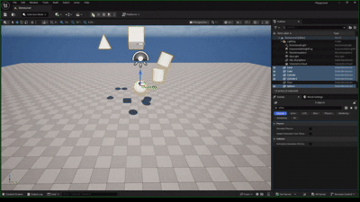
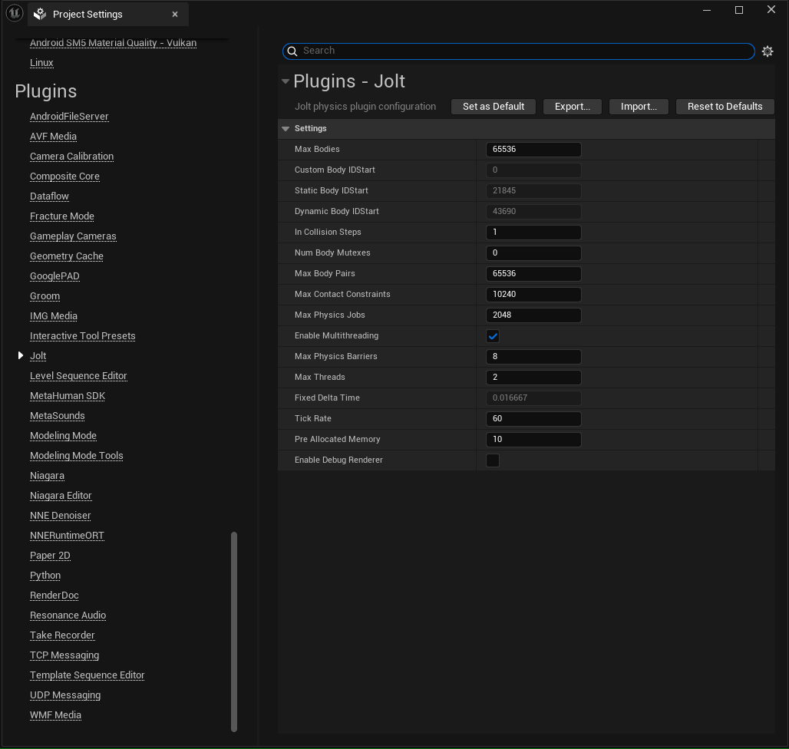
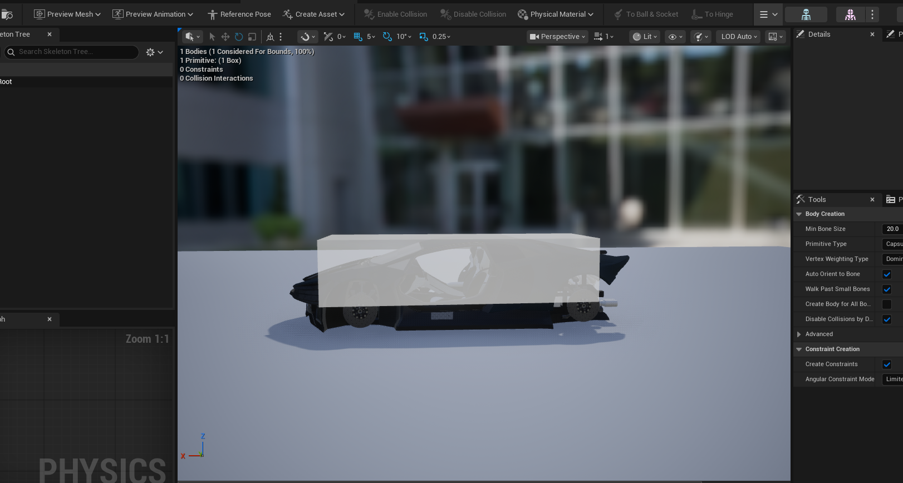
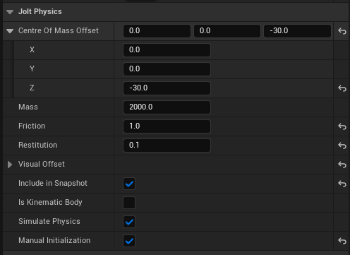
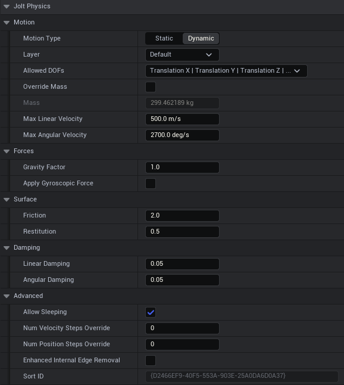
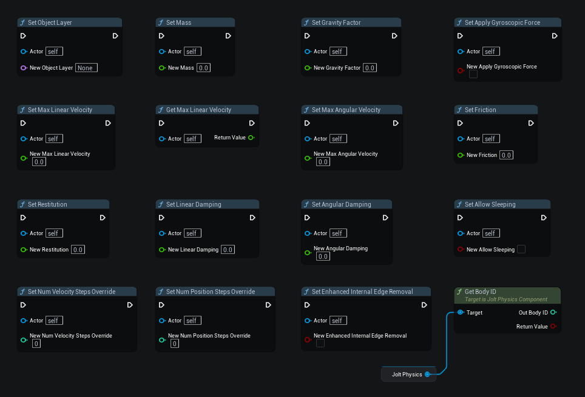
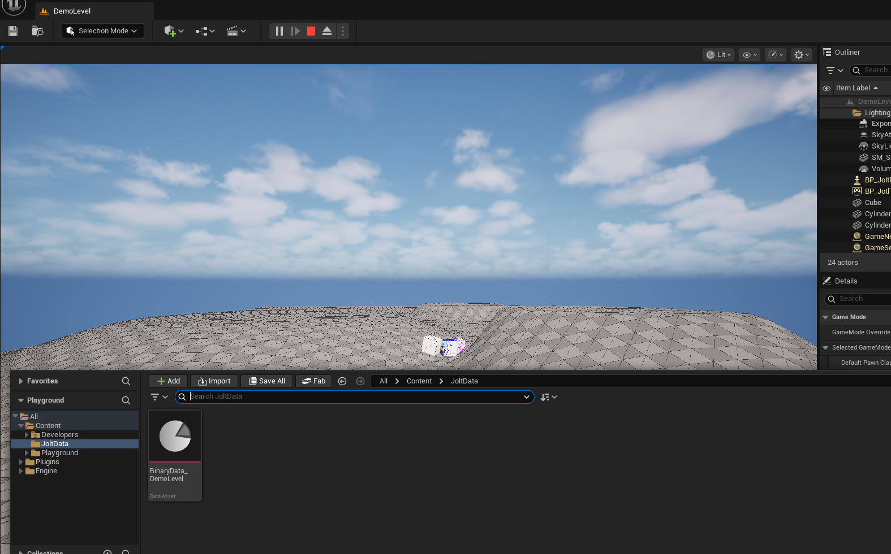

# UnrealJolt

Plugin that brings [Jolt Physics](https://github.com/jrouwe/JoltPhysics) into unreal engine 5

---

## Getting Started

### Some things to consider before using this

- This is a bolt on integration and not a replacement for the existing chaos physics solver.
- You should only need this if you specifically want some kind of behaviour that's not available in chaos.
- Deterministic physics, multicore processing of many bodies could make the case.
- Multicore processing it not yet implemented properly using Unreal's own thread pool system. 
- The implementation of this plugin while is generic (somewhat), is still tied to something I am developing on the side. Just keep in mind that all features of UE might not be integrated, you might have to do it yourself. (Drop a PR if you do :) )
- There are possibilities of breaking changes, until 1.0.0 at least. (will try to avoid)

### Requirements

- Unreal engine 5.8.1 (Might work on older versions)

### Installation

- Clone (`git clone --recursive git@github.com:Yadhu-S/UnrealJolt.git`) or download into the `Plugins` folder (`<project>/Plugins or Engine/Plugins`)
- Take a look inside `UnrealJoltLibrary.Build.cs` to see the user defines, modify what you need, or leave defaults. Check the available defines [ here ]( https://jrouwe.github.io/JoltPhysicsDocs/5.3.0/md__build__r_e_a_d_m_e.html )
- Compile project
- Make sure UnrealJolt is enabled in "Plugins"
- Use actor-tag and tag dynamic objects with `jolt-dynamic` (make sure that the object is movable) and static objects with `jolt-static` 

### Configuration

- Plugins->Jolt in your project settings.
- Check the defaults, and change if required.
- Debug rendering is slow, especially when visualizing large heightmaps. Drawing all those triangles. (Need to look into drawing triangles only once for
  static objects )

---

## Features

### UJoltSkeletalMeshComponent
- UJoltSkeletalMeshComponent extends USkeletalMeshComponent to add jolt specific functionality (Browse JoltSkeletalMeshComponent.h to see the available functions)
- Modify the physics asset as required through the editor
  - 
  - Compound shapes are also supported
- Adjust the options as required 
  - 
  - Adjust the "Visual Offset" to align the visual mesh with the physics body

### UJoltPhysicsComponent
- `UJoltPhysicsComponent` is a component alternative to the `jolt-static` / `jolt-dynamic` actor-tag workflow. Add it to any actor to get per-actor control over physics properties.
- Automatically creates its Jolt body on `BeginPlay` (or when the subsystem processes all actors at world start).
  - 
- **Motion Type**: `Static` or `Dynamic`. Note there's no runtime setter for this.
- **Layer**: pick the Jolt object layer this body collides on. Defaults to `Default`, which resolves to the project's default layer for the selected Motion Type (configured under **Project Settings > Plugins > Jolt > Layers**). Changing Motion Type resets it to `Default`. The two default layers themselves aren't offered by name — picking one would freeze the body on that layer and it would stop following Motion Type, which on a placed instance silently survives later edits to the Blueprint.
- **Allowed DOFs**: bitmask restricting which translation/rotation axes the body simulates on (e.g. lock rotation, or constrain to 2D movement). Only applies to non-static bodies.
- **Mass**: auto-computed from the owner's static meshes (collision geometry and physical material) at body creation; enable **Override Mass** to author a fixed value in kg instead. **Computed Mass** below it previews what the automatic calculation yields — it is display-only and never saved.
- **Gravity Factor**: per-body multiplier on world gravity.
- **Apply Gyroscopic Force**: simulates [gyroscopic torque](https://en.wikipedia.org/wiki/Tennis_racket_theorem) so spinning bodies resist changes to their spin axis.
- **Max Linear / Angular Velocity**: velocity caps for the body, in Unreal units — cm/s and deg/s. (Jolt works in m/s and rad/s; the conversion happens inside the plugin.)
- **Friction** / **Restitution**: surface properties for this body.
- **Linear / Angular Damping**: drag applied to linear and angular motion.
- **Allow Sleeping**: whether the body can go to sleep when at rest. Note that a sleeping body ignores property changes until something wakes it — call `Wake Body` after changing gravity factor, damping, mass or the velocity caps on a body that has come to rest.
- **Num Velocity / Position Steps Override**: per-body solver iteration overrides (0 = use project default).
- **Enhanced Internal Edge Removal**: extra effort to [remove ghost collisions](https://jrouwe.github.io/JoltPhysicsDocs/5.2.0/index.html#ghost-collisions) on internal mesh edges, at a performance cost.

- Every static mesh on the actor contributes collision: one Jolt body is created per actor, compounding all of its meshes, not one body per mesh.

- All of the above (aside from Motion Type) are also exposed as Blueprint-callable setters on the component (e.g. `SetMass`, `SetFriction`, `SetGravityFactor`, `SetAllowSleeping`, etc.), plus `GetMaxLinearVelocity` and `WakeBody`, so you can adjust physics properties at runtime from Blueprints. Grab the component with `Get Component by Class` and call the setter on it. Calling a setter before the body exists (or after the actor ends play) just updates the stored value, which `CreateBody` then applies.

### Heightmaps 

 

- **Landscapes** and **LandscapeSplines** are cooked automatically when you **Play in Editor**.  
  - This may be a chore if you work with many levels, playing a level at least one time in editor (will work on it).  
- A `JoltData` directory is always generated during cooking and **must be included when packaging your project**.
---

## Collision Layers

Configured under **Project Settings → Plugins → Jolt → Layers**.

- Add/remove **Broadphase Layers** and **Object Layers** using the array widgets.
- For each Object Layer, pick its **Broadphase Layer** from the dropdown.
- Toggle which layer pairs collide in the **Collision Matrix**.
- `Static` and `Dynamic` are required and cannot be deleted.

---

## Deterministic simulation

To ensure deterministic simulation with Jolt Physics across platforms, follow the [official guidelines](https://jrouwe.github.io/JoltPhysicsDocs/5.3.0/index.html#deterministic-simulation). Use Jolt’s math and utility functions (`Sin`, `Cos`, `QuickSort`, `BinaryHeapPush/Pop`, `Hash`) instead of STL or platform-dependent ones, and always keep API calls (body/constraint creation, updates) in the same order.

---

## Contributing

 Found this project useful? Awesome!

 If you’ve added a feature, fixed a bug, or improved something that isn’t here yet—feel free to open a PR!
 Note: The plugin must compile on both Linux and Windows.

---
## Credits
- [Jorrit Rouwe](https://github.com/jrouwe) for making jolt
- Andrea Catania for the video series on YouTube
